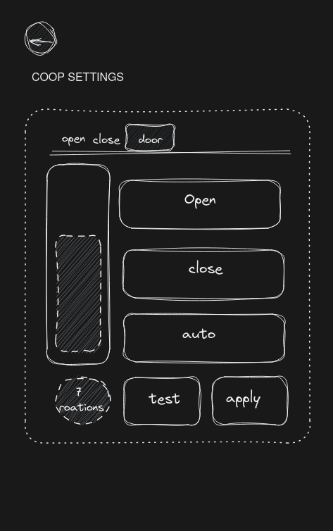

# [ESP32-COOP-DOOR](https://coop-door.vercel.app/)

Coop Door wireless control App 

# :dart: Goal
The goal is to make a simple mobile interface to setup your coop door over Bluetooth low energy

# :jigsaw: Functionality
Here are the settings that the app via bluetooth allow you to edit on the coop door:
- opening condition:
    - ambient brightness above *light value*
    - AND / OR
    - time past *time*
- closing condition:
    - ambient brightness below *light value*
    - AND / OR
    - time past *time*
- door setup
    - number of turn for opening/closing
    - test number of turn
    - status open / close / auto

# :arrows_counterclockwise: Workflow
here is an example of a sketch and the final result :

# :video_camera: Demo

Here is a simple demo of the current functionality

# :clipboard: Todo

- [x] Setup basic Svelte Kit
- [x] Layout different pages
- [x] Add interactive functionalities
- [x] Integrate Ble lib
- [x] Finish integration with [ESP32-COOP-DOOR-CORE](https://github.com/ESP32-COOP/ESP32-COOP-DOOR-CORE)
